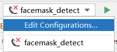
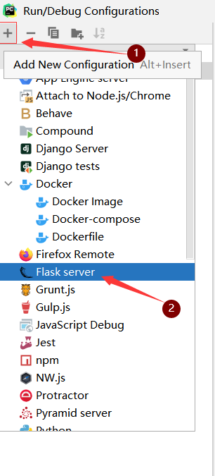
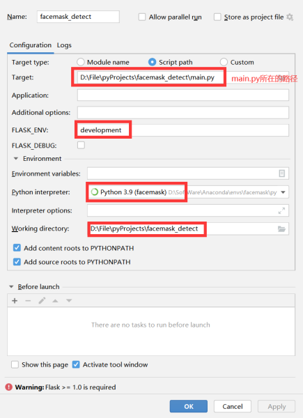

English | [中文](README_中文.md)

# Facemask_Detect

This project uses [yolov5n](https://github.com/ultralytics/yolov5) to detect mask wearing.

yolov5n is the smallest model in the yolov5 series, and its inference latency is acceptable.

**Simple function introduction:**

- Get real-time weather information by calling [qweather API](https://dev.qweather.com/docs/widget/).

- Use the dnn module in cv2 to load the yolov5n model in onnx format.

- Call the local camera and pass each frame into the model for inference mask wearing detection.

- Flask builds the front end of the web page and displays various information in real time.


## 1. Installation environment

```shell
pip install -r requirements.txt
````


## 2. Code usage

### 2.1 Start the project

#### 2.1.1 Start from Windows terminal

```shell
set FLASK_APP=main.py
flask run
````
After executing the above commands in sequence, a link will be output, just enter the link in the browser.

#### 2.1.2 Start from Pycharm

I am using the professional version of pycharm. If you do not find the following operations, please start from windows terminal.

The following operations only need to be configured when the project is started for the first time. After the configuration is successful, simply click the green triangle to run the project.

1. Select this position in the upper left corner and click Edit Configurations



2. Click the + sign to add a flask server



3. Set parameters according to my interface



4. After clicking ok, click the green triangle here


### 2.2 Enter the system

After entering the link, the account and password are both **admin**.


## 3. Modify the activated camera
If you have multiple cameras and want to change the camera called by the project, please modify the numbers in the following positions in [camera.py](controller/utils/camera.py), such as numbers 1, 2, 3, etc.


## TODO

- [ ] How to train yolov5n for mask detection.

- [ ] Try to use model pruning to compress the yolov5n model to reduce model parameters and computation.

This project is based on [facemask-detection-RaspberryPi](https://github.com/wenyuanw/facemask-detection-RaspberryPi)
Development, replace the SSD-like model with the more popular yolov5 series model. Thanks to the author for the open source project!