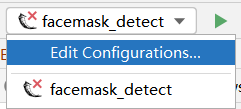
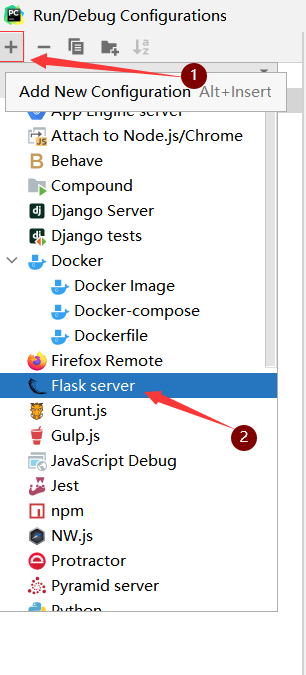
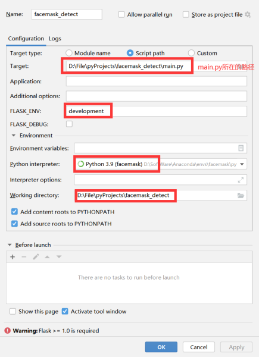
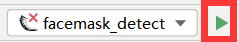
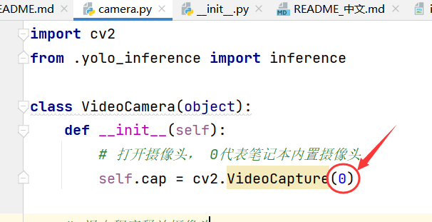

[English](README.md) | 中文

# 口罩佩戴检测

该项目使用 [yolov5n](https://github.com/ultralytics/yolov5) 进行口罩佩戴的检测。

yolov5n是yolov5系列中最小的一个模型，使用它进行推理，延迟还可以接受。

如果对您有帮助，请点Star支持。

**简单功能介绍：**

- 通过调用 [和风天气API](https://dev.qweather.com/docs/widget/) 获取实时天气信息。

- 使用cv2中的dnn模块加载onnx格式的yolov5n模型。

- 调用本地相机，并将每一帧传入模型中进行推理口罩佩戴检测。

- Flask搭建网页前端，实时显示各项信息。

## 1. 安装环境
```shell
opencv-python~=4.6.0.66
numpy~=1.23.3
flask~=2.2.2
````

使用以下命令自动安装：
```shell
pip install -r requirements.txt
````

## 2. 代码使用

### 2.1 启动项目

#### 2.1.1 windows终端

```shell
set FLASK_APP=main.py
flask run
```
按顺序执行上述命令后，会输出一个链接，在浏览器输入链接即可。

#### 2.1.2 pycharm启动

本人使用的是pycharm专业版，如果没有找到下列操作，请使用windows终端的启动方法。

以下操作只需要第一次启动项目时配置即可，配置成功后，直接点绿色三角即可运行该项目。
1. 选择左上角的这个位置，点击Edit Configurations
   


2. 点击+号，添加一个flask server



3. 按照我的界面设置参数



4. 点击ok后，点击这里的绿色三角




### 2.2 进入系统

输入链接后，账号和密码都是admin。 


## 3. 修改启动的摄像头
如果你有多个相机，想更改项目调用的相机，请修改[camera.py](controller/utils/camera.py)中如下位置的数字，如1、2、3等的数字。




## 稍后更新，敬请期待!

- [x] 如何训练yolov5n进行口罩检测，参考我的博文：[Yolov5口罩佩戴实时检测项目（opencv+python推理）](https://blog.csdn.net/xiaohaigary/article/details/109445547) 。

- [ ] 尝试使用模型剪枝压缩yolov5n模型，减少模型参数和计算量。

- [ ] 在网页中添加更改选择摄像头的功能

该项目基于[facemask-detection-RaspberryPi](https://github.com/wenyuanw/facemask-detection-RaspberryPi)
开发，将其中的类SSD模型换成目前较为流行的yolov5系列模型。感谢作者的开源项目！

